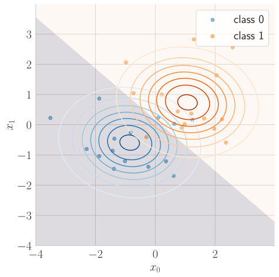
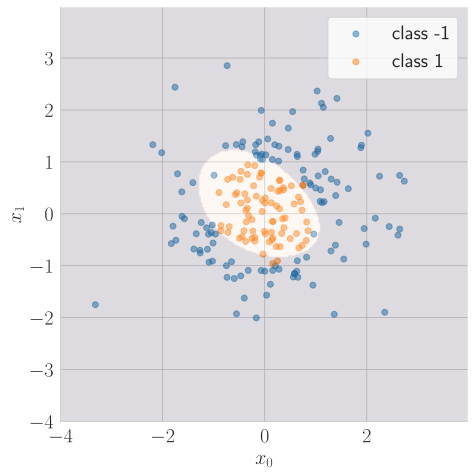

# ML-Scratch

This is a python library with numpy implementations of common machine learning algorithms. This was built for educational purposes as a means to learn the details of machine learning algorithms for myself. I hope that others who are learning machine learning will benefit from viewing these numpy implementations.

# Installing package `ml_scratch`

1. Clone this repo locally.
2. In Terminal, run `pip install -e .` within root directory of repository.

# The algorithms

Each algorithm listed below will have all or subset of the following links:
1. **Code** : This link directs you to the numpy implementation code of the algorithm within the `ml_scratch` library.
2. **Notebook** : This link directs you to a jupyter notebook demonstrates using the algorithm on data.

### Linear Regression
Two solvers are implemented to fit data: (1) normal equations and (2) gradient descent.
- [Code](https://github.com/cjm715/ml_scratch/blob/master/ml_scratch/linearRegression.py)
- [Notebook](https://github.com/cjm715/ml_scratch/blob/master/notebooks/LinearRegression.ipynb)

### Logistic Regression
Two solvers are implemented to fit data: (1) gradient descent and (2) Newton's method.
- [Code](https://github.com/cjm715/ml_scratch/blob/master/ml_scratch/logisticRegression.py)
- [Notebook](https://github.com/cjm715/ml_scratch/blob/master/notebooks/LogisticRegression.ipynb)

### Gaussian Discriminant Analysis

- [Code](https://github.com/cjm715/ml_scratch/blob/master/ml_scratch/GDA.py)
- [Notebook](https://github.com/cjm715/ml_scratch/blob/master/notebooks/GDA.ipynb)

### Naive Bayes Classifier
- [Notebook](https://github.com/cjm715/ml_scratch/blob/master/notebooks/Naive_Bayes.ipynb)

### Support Vector Machine (SVM)

This implementation is a simplified version of the full Sequential Minimal Optimization (SMO) algorithm.
- [Notebook](https://github.com/cjm715/ml_scratch/blob/master/notebooks/SVM.ipynb)
